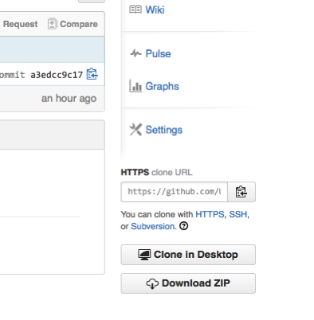
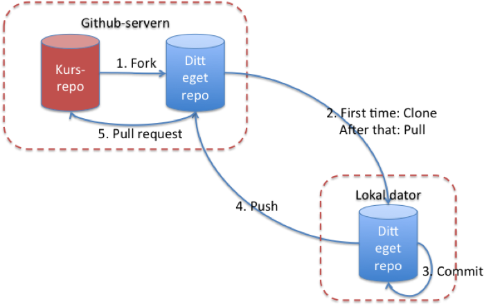
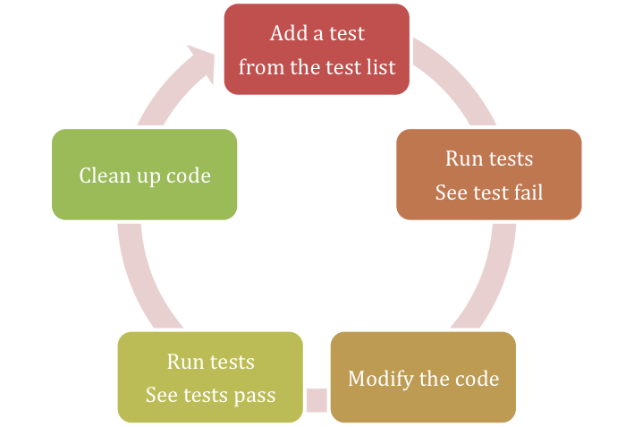

Instruktioner - uppgift 1501a-ht17
======
_Ulrik Eklund, 2015-11-11_
_Tommy Andersson, 2017-10-18_


Översikt och syfte med uppgiften
----
När man börjar med ett nytt programmeringsspråk eller med en ny utvecklingsmiljö är "Hallo World!" den klassiska första utskriften.
Vid programmering av inbyggda system, där man ju i regel inte har någon utskriftsmöjlighet är   motsvarigheten att skriva ett program som blinkar en lysdiod.
Det är precis det du skall göra i denna första uppgift men på vägen dit skall du lära dig en hel del nytt och repetera en del som du också kommer att använda i labbarna framöver.

1. Atmel Studio. Atmel Studio är ett exempel på en integrerad utvecklingsmiljö för inbyggda system (IDE, Integrated Development Environment) som du redan använt, men nu blir det mer...
2. Git och Github. Git är ett smart versionshanteringssystem för grupp-projekt, utvecklat av Linus Torvald, som används mycket "där ute". Github är ett av flera "moln" som stödjer Git. Vi kommer i kursen att använda Github Classroom tillsammans med Its learning för att administrera de flesta labuppgifter.
3. TDD, Test Driven Development. TDD är en programutvecklingsmetod som innebär att man först skriver tester och testfall innan man tar itu med den "riktiga" programmeringen. Du kommer inte att behöva skriva egna tester i kursen men däremot göra testkörningar av din kod.
4. Skriva en enkel driver i C för att kunna styra en digital utgång för SAM3X8E (den 32-bitars ARM-Cortex-M3 processor som finns på Arduino Due och som vi använder i denna kurs) och jämföra dess exekveringstid med motsvarande driver i ASF (Atmel Software Framework).

Utförande:
----
Uppgiften görs normalt två och två, men det går att jobba ensam också.

Det rekommenderas att ha ett eget USB-minne för katalogerna med din personliga kod även om det inte är helt nödvändigt, all kod du gjort i labben kommer att finnas ”i molnet” när du är klar.

Som vanligt så innehåller all mjukvara buggar, troligtvis även det exempelprojekt som labben utgår ifrån (och till och med denna labbhandledning). Se det som en del av labben att eliminera eventuella existerande buggar om de påträffas!

Krav för godkänt:
------
Ha genomfört följande moment enligt denna handledning:

1. Skapa ett eget lokalt "repo" baserat på det gemensamma repot på github som finns för uppgiften.
2. Starta Atmel Studio, modifiera källkoden i projektet, kompilera och ladda ner den till utvecklingskortet. Modifiera och köra programmet tills alla tester passeras.
3. Kontrollera att programmet som helhel fungerar som det är tänkt.
4. Göra mätningar av exekveringstid och jämföra  med driver i ASF. Dessa mätningar redovisas i separat labrapport på It's learning.
3. "Committa" filerna till ditt personliga repo, synka med github, och göra en ”pull request” till det centrala kursrepot.

Läraren kommer att kolla alla pull requests onsdagen - veckan efter labbhandledningen, efter uppsamlingslabbarna vid terminens slut och vid kursens slut. **Det kommer inte att bedömas några laborationer utanför kursen!**

Förberedelser
------
####Instudering

1. Labben kommer att innehålla grundläggande C-programmering, så repetera vad som gåtts igenom i kursen Datateknik från första året.  Givetvis måste du också ta dig genom materialet från föreläsningarna i denna kurs. Mer specifikt kommer du att behöva:
    1. Förstå deklarationer, tilldelning och bit-operationer på variabler (sektion 1 i [1]) + integers med fix storlek [2].
    2. Känna till vilka hårdvaruregister som används att styra digitala utgångar på en SAM3X8E Cortex-M3 microcontroller (sektion 31 i [3]).
    3. Förstå pekare (allmänt i sektion 3 i [1]), framförallt hur man använder pekare för att komma åt hårdvaruregister [5].
    4. Känna till hur pinnarna på Arduino Due förhåller sig till utgångarna på SAM3X8E [4]
    5. Hur man skapar större projekt med flera filer (sektion 5 i [1]).
    6. Tester för C-funktioner [6]
2. Det finns ett diagnostiskt test på It’s learning. Gör det innan du går till labbsalen som en koll på att du kan grunderna! Du kommer inte att bli godkänd på labben utan att ha fått godkänt på testet (allt rätt).
3. Läs igenom grunderna i versionshantering med git, t.ex. denna självstudiekurs: <http://try.github.io/levels/1/challenges/1> eller ännu hellre Philips och Arons skrift "Komma i gång med Git" <https://paper.dropbox.com/doc/Komma-igang-med-Git-Ss9pacvHCiwTXGkX7XFJc>. Om du läser och följer den är du väl rustad både för det som behövs av Git i denna kurs men också i kurserna längre fram.
4. Du skall också ha läst igenom hela denna handledning innan du går till labbsalen!

Även om du har förberett dig genom att läsa all teori är det ovanligt att du kommer att hinna göra klart uppgiften på 4 timmar (gäller alla labbuppgifterna i kursen).  Det går att skriva den mesta koden, eliminera kompileringsfel mm. utan att ha tillgång till något utvecklingskort.  

####Mjuk- och hårdvaruförutsättningar för att kunna börja på uppgiften

1. Om annan dator än labbsalens dator används (t.ex. egen dator) måste följande program finnas installerat på den datorn:
    1. Atmel Studio 7.0 (finns endast för Windows), med terminal installerad som en plug-in (alternativ separat terminalprogram).
    2. Bossac flashprogrammeringsdriver, inklusive DOS-macro (finns när du laddat ner uppgiftens repo från Github). Instruktioner finns i Appendix.
    3. En Git-klient, lämpligen [git-scm](https://git-scm.com ).
2. Alla studenter i labbgruppen måste också ha registrerat en användare på [github](http://www.github.com/)! Om du redan har en, använd den!
Meddela Tommy på _tommy.andersson@mah.se_ vilken din githubanvändare är.

**Gör det här innan ni kommer till labbsalen, ödsla inte tiden ni sitter där på saker ni kan göra hemma!**


Själva uppgiften
------

### 1: Skapa ett personligt repo för denna programmeringsuppgift med hjälp av Git

För att fortsätta jobba och ändå ha kontroll på vem som gör vad så låter vi Git hålla reda på det för alla studenter och lärare i kursen, vilket är en av Gits styrkor (och varför det används i projekt med hundratals utvecklare, t.ex. open-source-projektet Linux).

Vi använder Github Classroom som är gjort för att underlätta kursadminstration.
Jag som lärare skapar ett kursrepo på Github för respektive uppgift. Jag får då en länk som jag lägger ut på kursens It's learningsida. När du klickar på den skapas automatiskt en kopia av kursrepot på ditt användarkonto (om du inte har något sådant uppmanas du att registera ett).

Än så länge finns bara ditt nya repo på github-servern, men du vill ju kunna jobba med projektet lokalt på din dator. Därför måste du "klona" det nyligen skapade repot till din lokala dator, vilket betyder att du skapar en identisk kopia som du sen kan synka med ditt githubrepo med kommandona pull och push.  
Skapa en katalog på datorn (USB-minne eller hemkatalog M: eller lokalt om du använder en egen dator) där du vill ha din lokala kopia av repot. Kalla katalogen t.ex "Labbar_DA264A".

Starta nu Atmel studio 7.0, välj sen Tools/Command Prompt. 
Du får nu upp ett terminalfönster. Navigera dig nu till katalogen du skapade (om du inte vet hur du gör detta hittar du instruktioner i "Komma i gång med Git" <https://paper.dropbox.com/doc/Komma-igang-med-Git-Ss9pacvHCiwTXGkX7XFJc>)
När du är i katalogen skriver du
    
    >git init

Git kommer nu att hålla reda på vad som händer i katalogen.
Dags att klona ditt repo från Github till katalogen.
Tillbaka till githubrepot. Adressen du ska använda finns under HTTPS clone URL.
Nu tillbaka terminalfönstret och din katalog.
Kommandoraden blir typ så här:
    
    >git clone https://github.com/StudentNN/Task1501a.git

där `StudentNN` är ditt användarnamn på github.




Under labben är det enklast om man jobbar mot ett och samma repo i hela labben, även om det tillhör bara en specifik student. Om ni är två som vill jobba med varsitt lokalt repo kan ni ge båda studenterna rättigheter att jobba mot samma repo och sen klona repot på github till två olika datorer.



#### Arbetskatalogen för denna uppgiften

I katalogen `Task1501a` finns denna handledning i mappen `Instruction` och en projektmapp för Atmel studio vid namn `ProjectDigitalIO`


#### Använda Git

För att Git skall hålla reda på dina filerna  måste de först adderas till repo. Men räcker ju med filerna i `ProjectDigitalIO` .
Gå därför in denna katalog (via Command Prompt) och ge kommandot

    >git add --all

Med jämna mellanrum vill man committa sina ändringar till sitt lokala repo (Steg 3 i Figur 3). 
Git-shell-kommando:

    >git commit –am filnamn.x

Varje commit bör vara en ”unit of functionality” som alltid kompilerar, t.ex. refaktorera namnet på en funktion, en ny feature, eller förbättrad dokumentation. Varje commit måste också ha en beskrivande kommentar så man vet vad det faktiskt var man ändrade (Ett fullt realistiskt, avskräckande :), exempel kan ses på <http://xkcd.com/1296/>).  
Git sparar alla tidigare commits, så man kan när som helst backa till ett tidigare commit-tillfälle om det skulle behövas.
    
Skapar du en ny fil kan den behöva adderas till repot innan den committas första gången. Det gör med kommandot

    >git add filnamn.x

Git-klienterna brukar dock hålla reda på nyskapade filer i katalogerna som tillhör repot och frågar om de ska adderas.

### 2: Labbsetup

Utrustning:

- Utvecklingskort Arduino Due
- USB-kabel (USB <-> USB micro)

Vi ska använda några av de digitala utgångarna, varav den kopplad till pinne 13 driver den oranga lysdioden som finns på Due-kortet.  
_Vilken I/O-port på processorn driver denna utgång (se <http://arduino.cc/en/Hacking/PinMappingSAM3X>)?_

Due-kortet kan drivas med strömmen genom en USB-kabel från datorn om man inte behöver för mycket effekt till utgångarna och det räcker gott för denna labben.  USB-kabeln kopplas till USB-micro-kontakten märkt PROGRAMMING. När man programmerar eller ”flashar” kortet gör man det också genom samma USB-kabel.

### 3: Labbens programmeringsuppgift

När du lyckats med att klona git-repot finns det nu i katalogen `Task1501a\ProjectDigitalIO` på din lokala dator en projektfil för Atmel Studio:  `ProjectDigitalIO.atsln`  
Öppna den genom antingen genom att dubbelklicka eller genom ”open project” inifrån Atmel Studio. I fönstret till höger ser du de kataloger och filer som ingår i projektet. Det är första hand filerna som finns i katalogen src (source) som är intressanta.

Labben går ut på att ni ska skriva funktioner som passerar de testfall som finns definierade i projektet.  
Testa att kompilera projektet under menyn ”Build”. Det här kollar främst att syntaxen är rätt, variabler är definierade och lite annat. C har annars få begränsningar vad som är rätt eller fel i språket.

Du bör inte få några varningar om du använder samma version på utvecklingsmiljön som projektet gjort hittills (varningar som kan finnas är ”bara” för att en del variabler är definierade som aldrig används i den här labben, så vi bryr oss inte om dem). 

Ladda ner den färdiga binärfilen till Due-kortet via USB-kabeln med kommandot Arduino Due(Debug) under Tools-menyn.  
Finns inte det kommandot i menyn följ instruktionerna som finns som kommentarer i bat-filen som finns i projektkatalogen (den går att öppna med en vanlig editor och bygger på <https://github.com/ctbenergy/BossacArduinoDue>). Du måste givetvis uppdatera sökvägarna till var bossac.exe och bat-filen ligger på just din dator.
Både bossac-programmet och bat-filen finns i katalogen i uppgiftens git-repo.

#### Test-driven utveckling (Test-Driven Development TDD)
Wikipedia har en bra introduktion till testdriven utveckling: <http://en.wikipedia.org/wiki/Test-driven_development>
Rent generellt ser processen ut som nedan.


I den här labben är några av stegen redan givna för alla testerna. 

##### Förberedelse

1. Gör på en testlista. Det är redan gjort för den här labben och ser ut som följer:
    1. Port B utgång 27 initialiserad som en digital utgång = pin 13 på Due-kortet = lysdioden
    2. Sätt pin 13 till hög
    3. Pin 13 till låg
    4. Pin 22 initialiserad som digital utgång (Due pinne 22)
    5. Pin 22 till hög
    6. Pin 22 till låg
    7. Pin 13 och pin 22 initialiseras som utgångar
    8. Pin 13 och pin 22 båda till höga
    9. Pin 13 och pin 22 båda till låg

2. Skapa en .c–fil och en .h-fil med funktionerna som skall testas, detta är modulen som skall testas (också redan gjort: `digitalIO.h` och `digitalIO.c`)

##### Testcykeln

3. Välj ett test från testlistan (gör det i samma ordning som de står i `test_digitalIO.c`)
4. Skriv/uppdatera testfilen för funktionen som ska testas (redan gjort för alla tester)
5. Skriv/uppdatera en ”runner-fil” som exekverar valda tester (den första testen körs i `main.c`, de andra är bortkommenterade i det ursprungliga projektet)
6. Bygg projektet (kompilering + länkning)
7. Ladda ner den färdiga binärfilen med programmet till Due-kortet
8. Kör programmet på Due-kortet
9. Se testen fallera, för det finns ju inget innehåll i den funktion som ska testas. För att resultatet ska synas måste terminalfönstret inuti Atmel Studio vara installerat.
10. Skriv programkoden så att funktionen klarar av testet (lägg till kod i `digitalIO.c`)
11. Kompilera och kör
12. Se testen/testerna passera, annars upprepa 8-9.
13. Städa och eventuellt kommentera din kod om det inte redan är gjort.

##### Samla ihop resultaten från TDD-cykeln

14. Commit till ditt personliga repo (valfritt)
15. Upprepa testcykeln tills alla tester i testlistan är implementerade. Då är även de två funktionerna färdigprogrammerade!

#### Exempel på hur det ser ut för de tester som redan har implementerad kod

Hela projektet är organiserat som följer: Projektet har två kataloger som man jobbar mot, `src` och `test`. Funktionerna man utvecklar ligger i `src`.  
Testrunner-filen och filen(erna) med testerna ligger i katalogen test. Testramverket unity ligger i katalogen unity.  
När man sen vill använda sina testade filer i produktionssystemet behöver man bara filerna i src-katalogen. Testfilerna används alltså bara under utveckling.

##### En enkel testfil
Alla testfunktioner är av typen

```c
void test_TheFunctionsdoesSomethingUseful(void);
```

Dessa tester deklareras snyggast i en motsvarande h-fil för att inkluderas i runner-filen (se nedan).

Ta för vana att döpa testfilen för att testa `Module.c` till `test_Module.c` 
I det här projektet heter filen med c-koden för testerna `test_digitalIO.c` 
Den innehåller totalt 9 tester:

1. Det första testet kollar att initieringsfunktionen för utgång PB27 har initierats korrekt för att kunna användas som en digital utgång. Det görs genom att läsa av en status-bit för port B.
2. Det andra testet kollar att funktionen som sätter utgången till hög faktiskt gör det, också genom att läsa av en status-bit som ger det faktiska värdet på rätt utgång.

Resterande tester är uppbyggda på samma sätt, men är bortkommenterade. Så fort du har klarat av ett test kan du inkludera nästa test genom att ta bort kommenteraren för det testet.

##### Testrunner-filen som kör testerna

Filen som kör testerna  (runner-filen) är i det här fallet `main.c`  
Eftersom det är den här filen som allting körs ifrån måste den innehålla `main()`. Den måste också innehålla all nödvändig initiering av Due-kortet själv, många av de initialisationsfunktionerna kommer från Atmels ASF-bibliotek.

Det står kommenterat i main()var själva testramverket Unity börjar användas. Det är här det första testet körs.  
När man lägger till fler tester görs det efter befintliga tester, men innan UnityEnd();

##### Se resultatet från testerna

Eftersom det inte finns någon naturlig bildskärm kopplad till Due-kortet måste man få ut testresultaten på annat sätt.

I början på testrunner-filen finns hur man initierar att Due-kortet skriver på COM-porten på PC:n via USB-kabeln (`configure_console(void)`). Det gör det möjligt att använda terminalfönstret inifrån Atmel Studio som output för putchar() som Unity använder sig av. Men Terminalfönstret konkurrerar med Bossac om COM-porten så när man laddar ner sin binärfil till DUE-kortet måste terminalfönstret vara o-connectat (i Atmel Studio 7.0 görs detta automatiskt).  
Så fort man laddat ner sin binärfil till Due så startar ju programmet och därför missar man utskriften innan man gjort connect igen. Gör connect och tryck på reset-knappen för att starta testrunner-programmet om igen.

Om allt funkar som det ska ser du att Unity meddelar resultatet från testerna i terminalfönstret. Det går också att spara resultaten från terminalfönstret i en fil, vilket kommer att utnyttjas till inlämningen.

#### Själva koden som utvecklas

De funktioner som ska programmeras ligger i src-katalogen. I filen `digitalIO.c` finns två funktioner definierade

```c
void pinMode(int pinNumber, mode_definition mode)
void digitalWrite(int pinNumber, int value)
```

men det första testfallet gäller bara den första av dessa funktioner.

Titta på tabell 31-2 på sidan 629 i referensmanualen för SAM3X8E-processorn [3] som sitter på Due-kortet. Där finns ett programmeringsexempel för vilka register som används för att styra de digitala utgångarna
##### void pinMode(int pinNumber, mode_definition mode)
Konfigurerar en (1) utpekad pinne på Due-kortet att fungera som antingen en in- eller utgång. I den här uppgiften behöver funktionen bara programmeras för att konfigurera utgångar!  
Behöver man konfigurera två pinnar så får man anropa samma funktion två gånger med olika argument på pinNumber. Givetvis så skall det andra anropet inte ändra konfigurationer för den första pinnen (om det inte är samma pinne förstås).  
De register som behöver användas är (se sida 642 + 643 i [3]):

Offset | Register | Name | Access | Reset
---|---|---|---|---
0x0000 | PIO Enable Register | PIO_PER | Write-only | -
0x0010 | Output Enable Register | PIO_OER | Write-only | -

För att komma åt register på en speciell minnesadress kan man använda en pekare med följande deklaration

```c
/* defines the address for enabling the output pins of port B register with base adress 0x400E1000*/
uint32_t *const p_PIOB_OER = (uint32_t *) (0x400E1000U + 0x0010U);
```

Sen kan man sätta en enstaka bit i detta register med maskning på följande sätt: 
 
```c
*p_PIOB_OER |= 0x000000040;
```

##### int digitalWrite(int pinNumber, int value)

Funktionen ska sätt en utgång på Due-kortet till hög eller låg, förutsatt att pinnen tidigare har satts som en utgång med pinMode.  
De register som behövs för detta är ([sida 660-661][3]):

Offset | Register | Name | Access | Reset 
---|---|---|---|---
0x0030 | Set Output Data Register | PIO_SODR | Write-only | –
0x0034 | Clear Output Data Register| PIO_CODR| Write-only | -

När du har uppdaterat de två funktionerna i `digitalIO.c` så att alla nio testerna passeras har du klarat av nästan all programmering. Glöm inte att spara ner testutskriften från terminalen till en en fil `testResult.txt` i test-katalogen och committa det färdiga programmet till git på din dator.

Äntligen dags att verkligen se lysdioden blinka! Nu skulle man ju kunna skapa ett nytt projekt och importera funktionerna du skrivit.
Men vi nöjer oss med att lägga till följande loop efter `UnityEnd();` i ´test_digitalIO_runner.c´

```c
int i; /* loop counter for the delay */	
volatile int j; /* Dummy volatile to prevent compiler optimising the variable away */
int delay_length = 400000; /* variable determining the length of a delay */

while(1)	/* repeat blink in infinity */
{				
	j=0;	/* makes sure j doesn't overflow */
	
	digitalWrite(13, 1); /* sets a bit of I/O port B to high */
	for (i=0; i<delay_length; i++) /* The delay counter */
	{
		j++;	/* some easy predictable operation */
	}
	
	digitalWrite(13, 0); /* clears a bit of I/O port B */ 
	for (i=0; i<delay_length; i++) /* The delay counter */
	{
		j++;
	}
}
```
Bygg, ladda ner, kör och kontrollera att efter att testerna passerats börja lysdioden blinka.

4: Utför mätningar med oscilloskop
-----
Dags för några tidmätningar.
Följ anvisningarna i word-dokumentet "Mätningar - uppgift 1501a".


5: Ladda upp arbetet på github respektive It's learning för bedömning
------
Om du är klar med all programmering och alla mätningar är det vara dags att synka ditt lokala repo med det som du har på github.  
En viktig sak som måste göras är att lägga till eventuella nya filer till ditt repo (som `testResultat.txt`), man måste alltså tala om explicit vilka filer som git ska hålla reda på.

    >git add –all
    
säger till git att hålla reda på alla nya filer som skapats om man står i repots huvudkatalog.

Det går att fråga git-klienten om några nya filer har tillkommit i repots katalog.

    >git status
    
Innan man har lagt till filerna så uppdaterar en commit bara de filer som redan finns i repot.

Om du har gjort en slutlig commit, inklusive nya filer, kan det vara dags att görs med en push tillbaka till github (steg 3 i Figur 3: Översikt över hur man forkar, klonar och synkar kodrepot i kursen. Kursens gemensamma repo är rött, ditt privata repo är blått.). 

    >git push origin

Din gitklient är oftast så smart att den kommer ihåg varifrån man klonade repot, därför kan man oftast använda origin istället för den långa webbaddressen (<https://github.com/StudentNN/Task1501a.git>). 

Har du kommit så långt har du ett uppdaterat repo som du kan se på githubs webbsida. Nu ska du skicka in en begäran att ägaren till det gemensamma kursrepot ska titta på dina ändringar genom en pull request (steg 5 i Figur 3). Där anger du en rubrik (till exempel att du är klar med en viss uppgift), och fyller i en beskrivning av vad dina ändringar består av.
Glöm inte att ange namnen alla som bidragit med att göra klart uppgiften! Det går inte att komma i efterhand och påstå att du varit med om ditt namn inte finns med på originalinlämningen! I så fall får du göra en egen pull request efteråt.

Rapporten med mätningar och bilder gör du om till pdf och lämnar in på It's learning som vanligt.

Läraren kommer att titta på alla som har lämnat in till onsdag kväll veckan efter den schemalagda handledningen. Om du lämnar in senare kommer de att bedömas vid terminens slut i samband med tentan.

Referenser
======
[1] Nick Parlante, Essential C, 2003, <http://cslibrary.stanford.edu/101/>

[2] C data types, <https://en.wikipedia.org/wiki/C_data_types> 

[3] Atmel SAM3X / SAM3A Series SMART ARM-based MCU DATASHEET, 2015, <http://www.atmel.com/devices/sam3x8e.aspx>

[4] SAM3X-Arduino Pin Mapping, <http://www.arduino.cc/en/Hacking/PinMappingSAM3X> 

[5] Dan Saks, Representing and Manipulating Hardware in Standard C and C++, Embedded Systems Conference San Francisco, 2002, <http://www.open-std.org/jtc1/sc22/wg21/docs/ESC_SF_02_465_paper.pdf> 

[6] Mark VanderVoord, Embedded Testing With Unity And Cmock - A Book For Those Who Code C And Want Awesome Well-Tested Products Using Free Tools And For Those Who Enjoy Short Books with Long Titles, 2010

Appendix: Bossac-programmering
====

1. Copy the batch file and bossac.exe into the Solution folder of your Atmel Studio project 

2. Configure an 'External Tool' in Atmel Studio 6 (Tools -> External Tools...). 

   1 Configure a debug build command  
Titel: Arduino Due (Debug)  
Command: $(SolutionDir)\BossacArduinoDue.bat  
Arguments: "$(SolutionDir)\bossac.exe" "$(ProjectDir)\Debug\$(ProjectFileName).bin"  
Checkbox "Use Output Window". 

    2 Configure a release build command  
Titel: Arduino Due (Release)  
Command: $(SolutionDir)\BossacArduinoDue.bat  
Arguments: $(SolutionDir)\bossac.exe" "$(ProjectDir)\Release\$(ProjectFileName).bin"  
Checkbox "Use Output Window". 
 
3. Call 'External Tool' in Atmel Studio 6. 
_Tools -> BossacArduinoDue(Debug)_ for Debug Build or _BossacArduinoDue(Release)_ for Release Build


